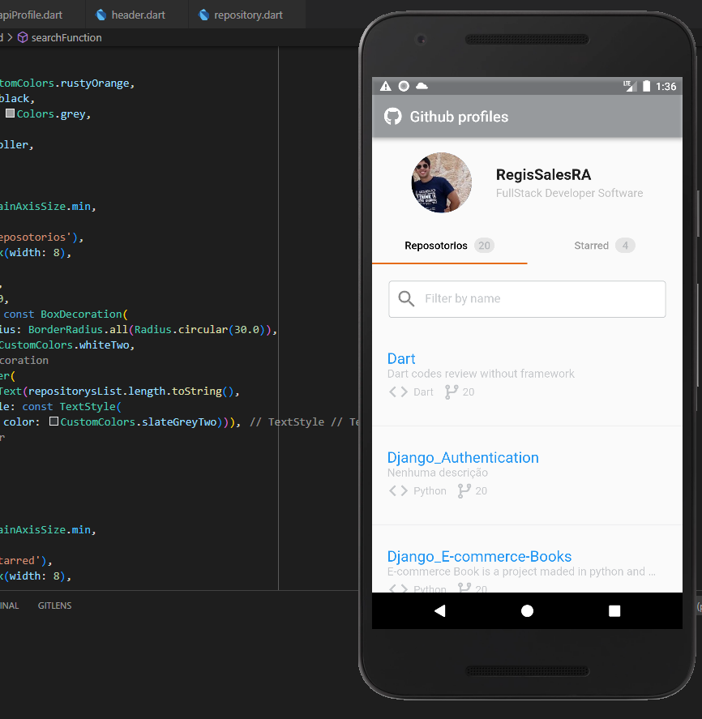

<h2>Screenshots</h2>





<h2>Como Utilizar</h2>
<p>

```

- Clone o repositório:
$ git clone https://github.com/DuhAlonso/Flutter_Github_Api.git

- Entre no diretório:
$ cd flutter_github_api

- Instale as dependências:
$ flutter pub get

- Execute:
$ flutter run
